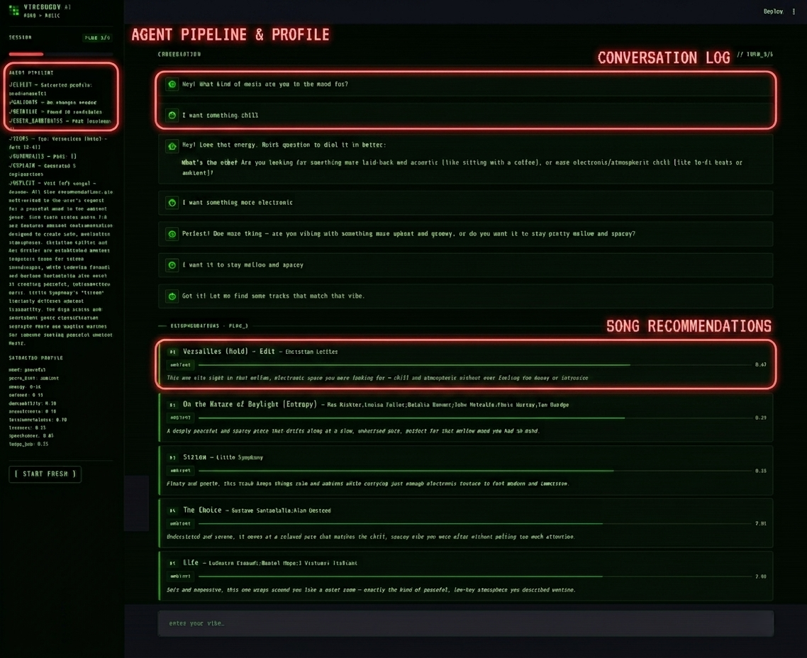
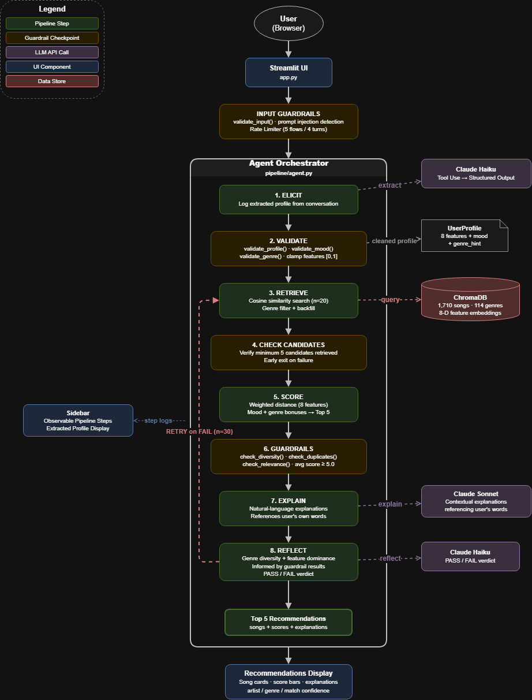

# Vibe Buddy AI

An AI-powered music recommendation system that turns natural-language mood descriptions into personalized song picks. Uses **RAG** (Retrieval-Augmented Generation) to search a real music catalog, an **agentic pipeline** for multi-step reasoning, and **guardrails** for reliability. Built with Claude, ChromaDB, and Streamlit.



---

## Highlights

- **Conversational input** — describe your mood in plain language instead of tuning sliders
- **RAG over a 1,710-song catalog** — real Spotify audio features across 114 genres, embedded and indexed in ChromaDB for vector similarity retrieval
- **8-step agentic pipeline** — observable reasoning from elicitation through self-critique
- **Genre-aware retrieval** — filtered search with alias mapping ("rap" → "hip-hop") and automatic backfill
- **Guardrails at three layers** — input validation, profile normalization, and output quality checks
- **Automated eval harness** — 8 tests proving the system handles documented failure modes

---

## Architecture



The system runs an 8-step pipeline orchestrated by `pipeline/agent.py`:

1. **ELICIT** — Log the structured profile extracted from conversation
2. **VALIDATE** — Clamp features to [0,1], fuzzy-match mood and genre
3. **RETRIEVE** — Cosine similarity search over ChromaDB (n=20), genre-filtered when applicable
4. **CHECK CANDIDATES** — Verify enough songs were retrieved before scoring
5. **SCORE** — Weighted distance across 8 audio features + mood/genre bonuses → top 5
6. **GUARDRAILS** — Check genre diversity, duplicate artists, relevance threshold
7. **EXPLAIN** — Generate natural-language explanations referencing the user's own words
8. **REFLECT** — LLM self-critique informed by guardrail results; retry once on failure (genre-aware: keeps matching songs, replaces mismatches)

Every step is logged with timestamps and displayed in the sidebar for full transparency.

---

## Tech Stack

| Component | Technology | Purpose |
|-----------|-----------|---------|
| Frontend | Streamlit | Chat interface + pipeline visualization |
| LLM | Claude API (Anthropic) | Conversation, extraction, explanation, self-critique |
| Vector Store | ChromaDB | Cosine similarity search over 8-D feature embeddings |
| Data | Kaggle Spotify Tracks Genre | 1,710 songs with real audio features |
| Testing | pytest + custom eval harness | 27 unit tests + 8 end-to-end eval tests |

**Model tiering for cost control:** Haiku handles extraction and self-critique (fast, cheap). Sonnet handles explanations (higher quality). Session caps (5 flows, 4 turns each) bound API usage per user.

---

## Quick Start

### Prerequisites

- Python 3.10+
- An [Anthropic API key](https://console.anthropic.com/)

### Setup

```bash
# Clone the repo
git clone https://github.com/MaksymY11/ai110-module3show-musicrecommendersimulation-starter.git
cd VibeBuddy-AI

# Install dependencies
pip install -r requirements.txt

# Set your API key
echo ANTHROPIC_API_KEY=sk-ant-...your-key... > .env

# One-time data setup
python utils/curate_dataset.py    # Curate the song catalog from raw Spotify data
python utils/data_loader.py       # Ingest into ChromaDB
```

### Run

```bash
streamlit run app.py
```

### Sample Interaction

```
User:  "I just finished a long run, I want something to cool down to"
Buddy: "Nice! Are you thinking acoustic and mellow, or more like a chill beat you can zone out to?"
User:  "Acoustic and mellow, maybe some folk vibes"

→ Extracts: energy=0.3, acousticness=0.85, mood=peaceful, genre_hint=folk
→ Retrieves 20 candidates (filtered by folk, backfilled)
→ Scores and selects top 5
→ Self-critique: PASS (3 genres represented)

Recommendations:
  1. "Harvest Moon" by Neil Young (folk) — Score: 9.2
     "After a long run, this is exactly the kind of warm acoustic wind-down..."
  2. ...
```

---

## Evaluation

### Eval Harness (`python eval_harness.py`)

8 automated tests targeting edge cases and documented failure modes:

| Test | What it checks | Result |
|------|---------------|--------|
| Energy dominance | High energy doesn't monopolize all 5 results | PASS |
| Contradictory preferences | Conflicting features don't crash the pipeline | PASS |
| Unknown mood | Invalid mood is fuzzy-matched by guardrails | PASS |
| Neutral user | All-0.5 profile produces genre diversity | PASS |
| Out-of-range values | Extreme values are clamped to [0,1] | PASS |
| Vague conversation | Underspecified input triggers follow-up, not extraction | PASS |
| Refinement | Changing preferences produces measurably different results | PASS |
| Genre hint | Requested genre dominates results after retry | PASS |

### Unit Tests

```bash
pytest tests/test_guardrails.py -v   # 18 tests — all guardrail functions, no API calls
pytest tests/test_retriever.py -v    # 4 tests — ChromaDB integration
pytest tests/test_scorer.py -v       # 5 tests — scoring and ranking logic, no API calls
```

---

## Project Structure

```
VibeBuddy-AI/
├── app.py                      # Streamlit UI (chat interface + pipeline sidebar)
├── pipeline/
│   ├── __init__.py
│   ├── agent.py                # 8-step agentic orchestrator
│   ├── conversation.py         # Multi-turn conversation + preference extraction
│   ├── explainer.py            # LLM explanation generation (Sonnet)
│   ├── guardrails.py           # Input/output validation, prompt injection detection
│   ├── llm_client.py           # Claude API wrapper (prompt caching, model tiering)
│   ├── rate_limiter.py         # Session cost controls
│   └── scorer.py               # Weighted distance scoring (8 features + bonuses)
├── utils/
│   ├── curate_dataset.py       # Spotify CSV → curated songs.csv
│   ├── data_loader.py          # CSV → ChromaDB ingestion
│   └── retriever.py            # ChromaDB query (genre-filtered + backfill)
├── data/
│   ├── songs.csv               # 1,710-song catalog (114 genres × 15 songs)
│   ├── original_songs.csv      # Original 18-song baseline (preserved for eval)
│   └── train.csv               # Raw Spotify dataset
├── tests/
│   ├── test_agent.py           # Agent integration test
│   ├── test_guardrails.py      # 18 guardrail unit tests (no API calls)
│   ├── test_retriever.py       # 4 ChromaDB integration tests
│   └── test_scorer.py          # 5 scoring and ranking tests
├── eval_harness.py             # 8-test automated evaluation
├── assets/
│   ├── architecture.png        # System architecture diagram
│   └── demo_screenshot.png     # App demo screenshot
├── model_card.md               # Detailed model documentation
├── REFLECTION.md               # Development process and base project context
├── requirements.txt
└── .gitignore
```

---

## Documentation

- **[Model Card](model_card.md)** — Scoring logic, data details, limitations, bias analysis, and evaluation results
- **[Reflection](REFLECTION.md)** — Base project context, how AI was used in development, and lessons learned

---

## License
