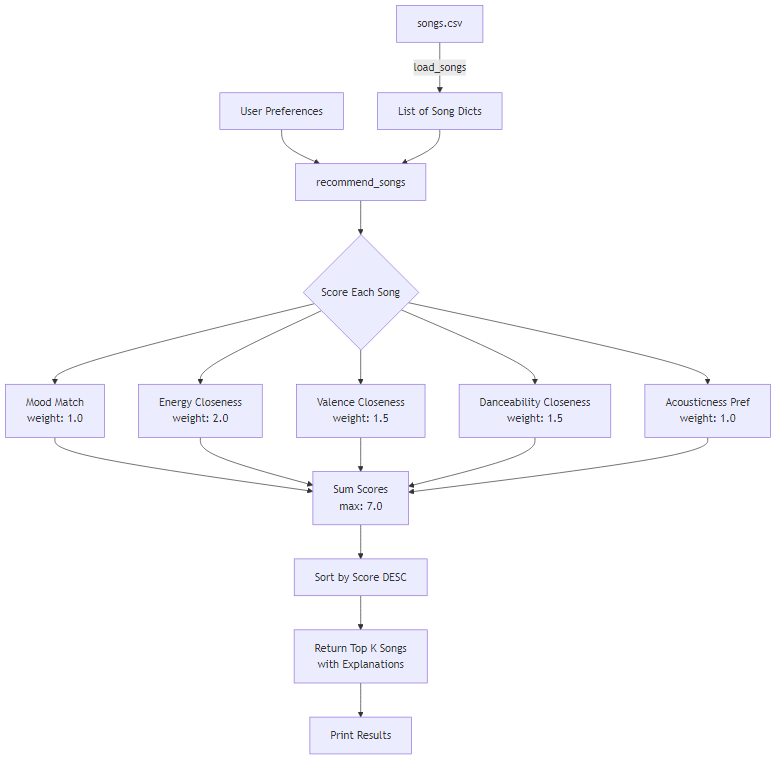
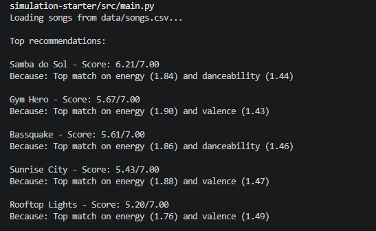
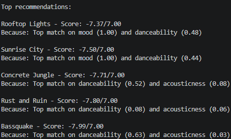
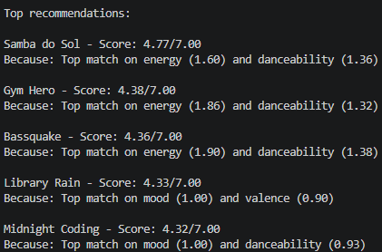
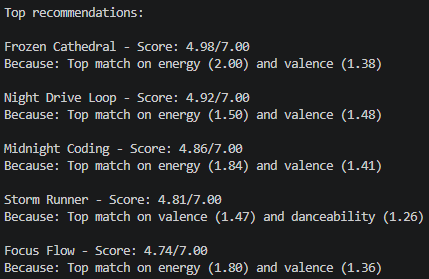
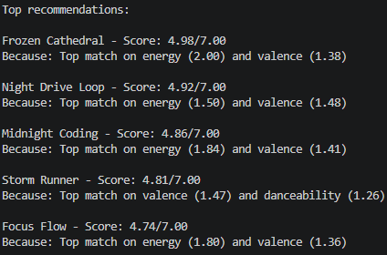

# 🎵 Music Recommender Simulation

## Project Summary

In this project you will build and explain a small music recommender system.

Your goal is to:

- Represent songs and a user "taste profile" as data
- Design a scoring rule that turns that data into recommendations
- Evaluate what your system gets right and wrong
- Reflect on how this mirrors real world AI recommenders

Replace this paragraph with your own summary of what your version does.

---

## How The System Works

- What features each `Song` uses:
  - Energy
  - Valence
  - Danceability
  - Acousticness
  - Instrumentalness
  - Liveness
  - Speechiness
  - Mood (categorical, derived from Russell's Circumplex Model)
- Infomration `UserProfile` stores:
  - energy_score: float
  - valence_score: float
  - dance_score: float
  - likes_acoustic: bool
  - mood: str
- How `Recommender` computes a score for each song:
  - score = 1 - |song_value - user_preference|, where song_value is The song's feature value (e.g., energy = 0.82), and user_preference is The user's preferred value (e.g., energy = 0.80)
- How songs get recommended:
  - Score gets computed for each song, then songs are ranked by score in descending order
  - Recommender places bias on energy closeness, potentially ignoring acousticness or mood match.

---

# 🎧 Model Card: Music Recommender Simulation

## 1. Model Name

**Vibe Buddy**

---

## 2. Intended Use

Vibe Buddy takes listener preferences (energy, valence, danceability, a target mood, and whether they like acoustic music) and returns the top-k songs from a small curated catalog, each with a score out of 7.00 and a short "because" explanation.

- Recommendations: a ranked list of k songs with a numeric score and a one-line explanation of the two strongest contributing features.
- User assumptions: the user self-reports numeric preferences in [0, 1], picks a single mood label, and expresses a binary acoustic preference.
- Audience: classroom exploration, not real listeners or production use.

---

## 3. How the Model Works

Each song is tagged with a genre, a mood label, and four numeric traits between 0 and 1: energy, valence ("happiness"), danceability, and acousticness. The user describes themselves on the same numeric scale, plus a mood word and a yes/no for liking acoustic music.

For each song, the model compares the user's numbers to the song's, trait by trait; the closer the match, the more points that trait contributes. Mood is a plain yes/no: it adds a point only if the song's mood label equals the user's. Acousticness flips direction based on preference: acoustic lovers get more points for acoustic songs, non-acoustic users get the opposite.

Traits are weighted unequally: energy is weighted 2.0, valence and danceability 1.5 each, and mood and acousticness 1.0 each. All contributions are summed, songs are ranked by total, and the top k are returned with an explanation naming the two features that contributed most.

Compared to the starter, the scoring was built from scratch using weighted distance for numeric features, exact-match for mood, and a direction-flipping term for acousticness, plus a top-2-feature explanation string.

---

## 4. Data

- **Original catalog:** 18 handcrafted songs (preserved in `data/songs_original.csv` as baseline for evaluation).
- **Expanded catalog:** 1,710 songs curated from the Kaggle "Spotify Tracks Genre" dataset. 15 songs sampled per genre with a fixed random seed for reproducibility.
- **Source:** Kaggle Spotify Tracks Genre dataset, containing real Spotify audio features.
- **Features (8 numeric):** energy, valence, danceability, acousticness, instrumentalness, liveness, speechiness, tempo_bpm — all in 0.0–1.0 range (except tempo_bpm which is raw BPM).
- **Genres:** 114 genres from the Spotify dataset, balanced at 15 songs each.
- **Moods (12):** excited, happy, energetic, aggressive, intense, fiery, peaceful, chill, tender, melancholy, moody, sad — derived using Russell's Circumplex Model of Affect (valence × energy quadrants) with acousticness and danceability as tiebreakers within each quadrant.
- **Curation script:** `utils/curate_dataset.py` — reads the raw Kaggle CSV, samples by genre, derives mood labels, renames columns, and outputs the final `data/songs.csv`.
- **Known gaps:** mood distribution is uneven (aggressive/happy/melancholy are overrepresented; tender/chill/sad are underrepresented) due to the natural distribution of Spotify audio features.

---

## 5. Strengths

- Clear-vibe users: listeners with strong energy/valence/dance preferences get intuitive rankings (e.g. high-energy + high-valence + dance-loving reliably surfaces Samba do Sol, Bassquake, Gym Hero).
- Transparent scoring: every rec comes with an honest two-feature explanation — great for teaching and debugging.
- Mood as a tie-breaker: when the mood label genuinely exists in the catalog, it cleanly separates otherwise-similar songs.
- Extreme ends match intuition: low-energy + acoustic-loving consistently surfaces Golden Hour Waltz, Library Rain, Spacewalk Thoughts.

---

## 6. Limitations and Bias

1. Energy Dominance Bias
   - Due to energy having weight of 2.0, combined with danceability and valence weights of 1.5, a user who sets energy_score to 0.9, will most likely get high energy, upbeat songs, completely disregarding set mood.

2. High-Energy Caralog Skew
   - Dataclass itself has 9 of 18 songs with energy > 0.75, but only 3 with enegegy < 0.35, which would make a mid-energy user (0.5) find fewer matches on the low end.

3. Mood is a Binary Feature
   - Mood contrubites exactly 1.0 or 0.0, there's no notion of "happy" being closer to "joyful" than to "angry", so a user who picks mood = "jouful" will get mood contribution only for "Samba do Sol", with everything else scoring 0 on mood.

---

## 7. Evaluation

Test 1: Out-of-range Extremist

- Tested with user_prefs = {"valence score": -2.0}
- Breaks the scoring formula due to having out of range values (beyond [0,1])

  

Test 2: Contradictory Acoustic Lover

- Tested with user_prefs = {"energy_score": 1.0, "valence_score": 1.0, "likes_acoustic": True}
- High energy songs are rarely acoutic, thus resulting in top recommendations that are not that good of matches, but rather least-bad compromises.

Test 3: Unknown Mood String

- Tested with mood string that is a typo/not in catalog user_prefs = {"mood": "melancholic-vibes-2026"}
- Mood contribution becomes 0 for each song, so feature is silently dropped with no warning.

Test 4: Perfectly Neutral User

- Tested with user_prefs = {"energy_score": 0.5, "valence_score": 0.5, "dance_score": 0.5,
  "likes_acoustic": False, "mood": "sad"}
- Exposes bias, due to ranking being dominated entirely by mood match and acousticness.

---

## 8. Future Work

- Richer features: add tempo preference, genre affinity (multi-select with weights), era/year, and language.
- Soft mood matching: replace exact-string mood with a similarity map (e.g. "joyful" ≈ "happy" ≈ 0.8) or embeddings so near-synonyms contribute partially.
- Input validation: clamp numeric prefs to [0, 1] and warn on unknown mood strings instead of silently scoring 0.
- Diversity in top-k: penalize near-duplicates so the top 5 aren't all the same artist/genre.
- Better explanations: phrase contributions in human terms ("high-energy, upbeat, matches your chill mood") instead of raw numbers.
- Learned weights: replace hard-coded 2.0/1.5/1.0 with weights fit from user feedback.

---

## 9. Personal Reflection

The biggest learning moment for me was how easy it is to confuse a recommender system, and how much more sophisticated these systems need to be in order to work like they should. Beyond matching user's preferences, these systems need to extract and normalize featueres, validate input, and balance bias, which are things I haven't thought about prior to working on this project.

When it comes to AI Tool's contributions, it was helpful to see more personalized explanations contributing to factors like "why should we use feature A vs feature B", "why should this feature A's vector should score more than others". It would be very tedious trying to look this up online, thus saving me a lot of time and giving me valuable insights into how these systems are built from architectural perspective.

What surprised me the most is how little code it takes to make output feel "opinionated", Vibe Buddy only uses weighted sum over five numbers, but when it says "Samba do Sol because it's a top match on danceability and valence," it reads like the system understood me, even though it only measured distance on a couple of axes and sorted.

If I were to extend this project, I would replace hard-coded weights, and binary mood match with softer, learned signals, fitting weights from user feedback and treating mood as a similarity map instead of exact string.

---
